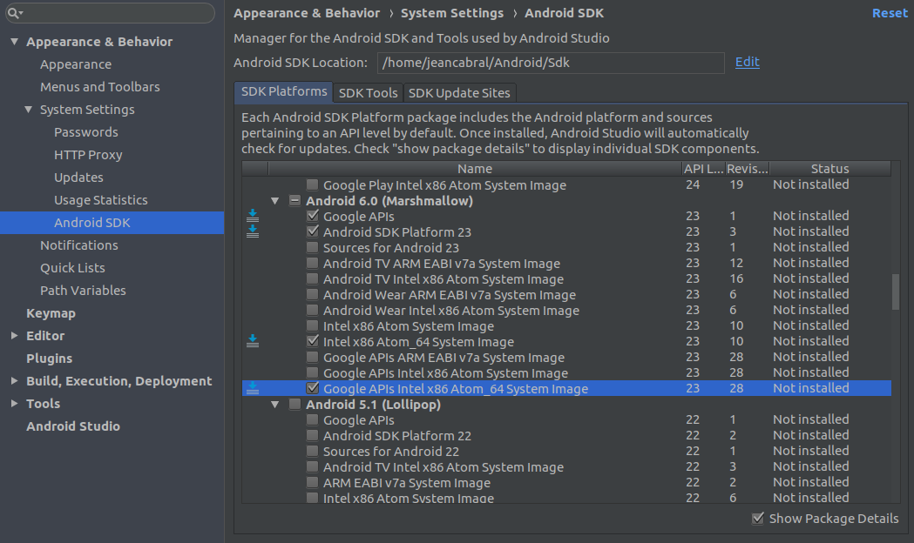

# Exemplo React Native + Appium + Cucumber

Este repositório tem como objetivo demonstrar o funcionamento da ferramenta de teste *end-to-end* Appium + Cucumber para teste em aplicativos mobiles.

## Configuração do projeto.

### 1. NodeJS

Como o React Native é um framework em JavaScript, é necessário que você tenha o Nodejs instalado. 

* [Instalação no Linux](https://medium.com/@jeancabral/ambiente-para-o-desenvolvimento-de-node-js-com-nvm-no-ubuntu-18-04-c636db90f998)

* [Instalação no Windows](https://nodejs.org/en/download/)

### 2. JDK

Geralmente, aplicativos nativos para Android são criados em Java. Então Java Development Kit é necessário. Execute no Terminal. Para este projeto é necessário a versão 8 do Java.

```sh 
sudo add-apt-repository ppa:openjdk-r/ppa
sudo apt update
sudo apt install openjdk-8-jdk
```

### 3. Android Studio

Para o desenvolvimento Android no React Native é necessário ter o Android Studio instalado. Para a instalação no *Windows* e *Linux*, siga o tutorial do [Android Studio](https://developer.android.com/studio/install?hl=pt-br#64bit-libs)

### 4. Android SDK

O desenvolvimento em React Native com código nativo, requer o SDK do Android versão 6.0 (Marshmallow) com requisito. SDKs adicionais para Android podem ser instalados por meio do SDK Manager no Android Studio.

O SDK Manager pode ser acessado na tela Bem-vindo ao Android Studio. Clique em Configure e selecione SDK Manager.


Em seguida, marque a caixa ao lado de “Show Packages Details” no canto inferior direito. Procure na lista por Android 6.0 (Marshmallow) e verifique se os itens a seguir estão marcados:
* Google APIs
* Android SDK Platform 23
* Intel x86 Atom_64 System Image
* Google APIs Intel x86 Atom_64 System Image



Clique em Apply e depois Ok, na tela de confirmação, para instalar as dependências.

### 5. Configurando a variável de ambiente ANDROID_HOME

As ferramentas React Native exigem que algumas variáveis de ambiente sejam configuradas para criar aplicativos com código nativo.

No terminal e abra o arquivo:

`sudo nano ~/.bashrc`

Copie e cole as seguintes linhas no final do arquivo.

```
export ANDROID_HOME=$HOME/Android/Sdk
export PATH=$PATH:$ANDROID_HOME/emulator
export PATH=$PATH:$ANDROID_HOME/tools
export PATH=$PATH:$ANDROID_HOME/tools/bin
export PATH=$PATH:$ANDROID_HOME/platform-tools
```

Após as alterações para salvar e sair do Editor:
* Pressione Ctrl + O (Gravar)
* Pressione Enter
* Pressione Ctrl + x (Sair do Editor)

### 6. React Native CLI

CLI que significa command-line interface (interface de linha de comando), ele é resumidamente uma interface que suporta passagem de parâmetros via linha de comando em terminais e/ou semelhantes.

Para instalar o React Native CLI podemos usar o npm. No terminal, execute o comando:

`npm install -g react-native-cli`

Agora que temos o React Native CLI devidamente instalado, podemos executar no projeto.

### 7. Executando o projeto

Para executar o projeto, no terminal execute os seguintes comandos:

```
npm install
react-native link react-native-vector-icons
npm i install metro-core
react-native run-android
```

Para o exemplo foi utilizado o código do repositório livre [NativeBase-KitchenSink](https://github.com/GeekyAnts/NativeBase-KitchenSink)

## React Native

O React Native é um projeto desenvolvido pelos engenheiros do Facebook e que consiste em uma série de ferramentas que viabilizam a criação de aplicações móveis nativas para a plataforma iOS e Android, utilizando o que há de mais moderno no desenvolvimento Front-end. 

O stack do React Native é poderoso, pois nos permite utilizar ECMAScript 6, CSS Flexbox, JSX, diversos pacotes do NPM e muito mais. Sem contar que nos permite fazer debug na mesma IDE utilizada para o desenvolvimento nativo com essas plataformas (além de tornar o processo extremamente divertido).


## Cucumber

## Appium

### Referências.

* [React Native](https://facebook.github.io/react-native/docs/getting-started.html).
* [Android Studio](https://developer.android.com/studio/index.html).